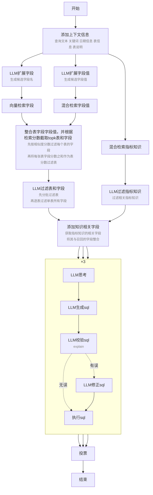

# 功能
## 规划

## 工具
- bash
- read
- edit
- write
- skill

## 状态管理
代理依次执行脚本，脚本将结果存储到.json状态文件中，后面脚本从.json状态文件中读取状态
不同请求间状态文件的隔离

## 子代理委托
子代理拥有独立状态、独立上下文。在子代理执行结束后决定将哪些内容返回总状态、总上下文。

# 技能
https://platform.claude.com/docs/zh-CN/agents-and-tools/agent-skills/overview
## 渐进式披露
1. 技能元数据(始终加载)
SKILL.md 文件最顶端 yaml 格式的元数据，包含 name、description
2. 技能详细信息(技能触发时加载)
SKILL.md 文件所有内容
3. 资源与代码(按需加载)
附加技能目录或文件，在 SKILL.md 中引用

# 权限隔离

# Benchmark
- BIRD-SQL
    https://bird-bench.github.io/
- Spider 2.0
    https://spider2-sql.github.io/
# 流程

