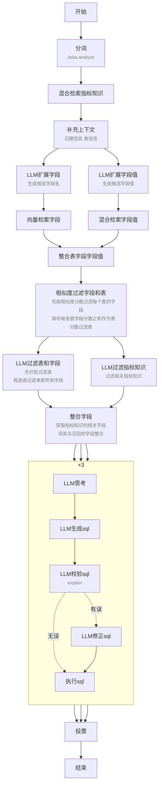

# 功能
## 规划

## 计算机访问

## 子代理委托
子代理拥有独立状态、独立上下文。在子代理执行结束后决定将哪些内容返回总状态、总上下文。

# 技能
https://platform.claude.com/docs/zh-CN/agents-and-tools/agent-skills/overview
## 渐进式披露
1. 技能元数据(始终加载)
SKILL.md 文件最顶端 yaml 格式的元数据，包含 name、description
2. 技能详细信息(技能触发时加载)
SKILL.md 文件所有内容
3. 资源与代码(按需加载)
附加技能目录或文件，在 SKILL.md 中引用

# 权限隔离


# Benchmark
- BIRD-SQL
    https://bird-bench.github.io/
- Spider 2.0
    https://spider2-sql.github.io/

# 元数据
## 配置信息
### 数据库信息
```yaml
db_code: # 数据库编号
db_name: # 数据库名称
db_type: # 数据库类型
database: # 数据库
host: # 服务器地址
port: # 端口号
user: # 用户名
password: # 密码
```
### 表信息
```yaml
table:
  tb_code: # 表编号
    tb_name: # 表名
    tb_meaning: # 表含义
    # fact_or_dim: # 事实表还是维度表
    sync_col: # 同步字段值的字段，为空则同步所有字段
    no_sync_col: # 不同步字段值的字段，先获取同步字段，再从中去掉不同步的字段
    col_info: # 字段额外信息
      col1:
        col_meaning: # 字段含义
        field_meaning: # JSONB字段中每个字段的含义
        col_alias: # 字段别名
        rel_col: table.column # 关联字段

```
### 指标知识
```yaml
knowledge: # 知识
  0:
    kn_name: # 名称
    kn_desc: # 描述
    kn_def: # 定义
    kn_alias: # 别名
    rel_kn: # 相关知识
    rel_col: # 相关字段
```

## Neo4j Schema
### 节点
- DATABASE
  - db_code # 数据库编号
  - db_name # 数据库名称
  - db_type # 数据库类型
  - database # 数据库
- TABLE
  - tb_code # 表编号
  - tb_name # 表名
  - tb_meaning # 表含义
- COLUMN
  - tb_code # 表编号
  - col_name # 字段名 (向量化)
  - col_type # 字段类型
  - col_comment # 字段注释 (向量化)
  - fewshot # 示例值 (向量化)
  - col_meaning # 字段含义 (向量化)
  - field_meaning # JSONB字段中每个字段的含义 (向量化)
  - col_alias # 字段别名 (向量化)
  - rel_col # 相关字段
- KNOWLEDGE
  - db_code # 库编号
  - kn_code # 知识编号
  - kn_name # 知识名称 (向量化)
  - kn_desc # 知识描述 (向量化)
  - kn_def # 知识定义
  - kn_alias # 知识别名 (向量化)
  - rel_kn # 相关知识
  - rel_col # 相关字段
- EMBED_COL
  - content # 嵌入内容
  - embed # 嵌入向量
- EMBED_KN
  - content # 嵌入内容
  - embed # 嵌入向量
  - tscontent # 全文搜索字段
- CELL
  - content # 嵌入内容
  - embed # 嵌入向量
  - tscontent # 全文搜索字段
### 关系
- TABLE-[BELONG]->DATABASE
- COLUMN-[BELONG]->TABLE
- COLUMN-[REL]->COLUMN
- KNOWLEDGE-[CONTAIN]->KNOWLEDGE
- KNOWLEDGE-[REL]->COLUMN
- EMBED_COL-[BELONG]->COLUMN
- EMBED_KN-[BELONG]->KNOWLEDGE
- CELL-[BELONG]->COLUMN

# 流程


# 架构
- workflow 工作流
- tool 工具
- db 存储